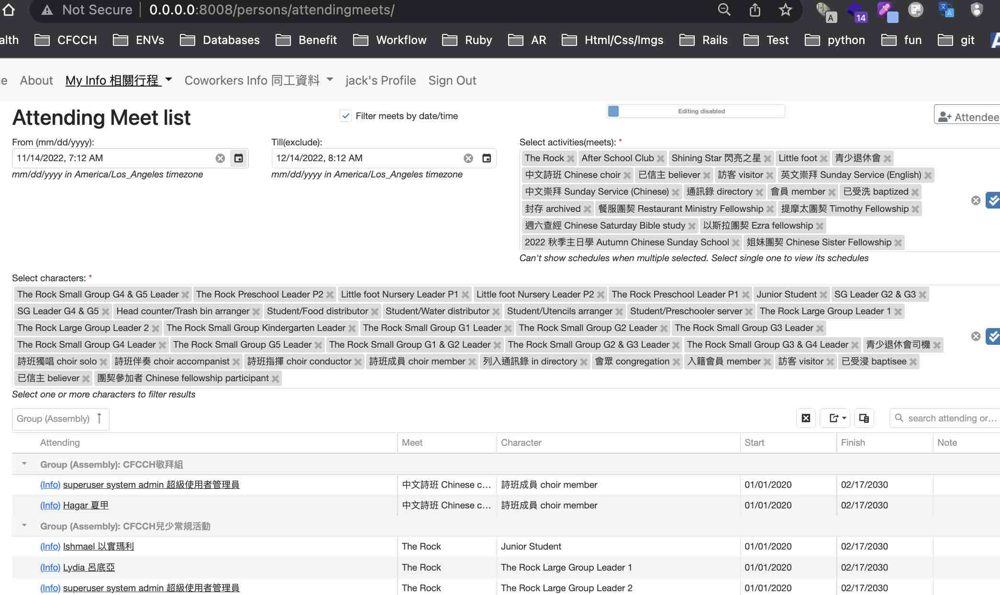

# Attendees

Attendees in Django 3.2
## An app for general event management
- Tracking who/when/where/what of any activities with attendance records.
- Monolith architecture on docker [](https://github.com/cookiecutter/cookiecutter-django/) and Javascript([DevExtreme](https://js.devexpress.com/Licensing/#NonCommercial)) with Postgres/PostGIS & Redis



[](https://github.com/ambv/black)

License: MIT

## Settings

Moved to [settings](http://cookiecutter-django.readthedocs.io/en/latest/settings.html).

## Basic Commands

### Setting Up Your Users

-   To create a **normal user account**, just go to Sign Up and fill out the form. Once you submit it, you'll see a "Verify Your E-mail Address" page. Go to your console to see a simulated email verification message. Copy the link into your browser. Now the user's email should be verified and ready to go.

-   To create an **superuser account**, use this command:

        $ python manage.py createsuperuser

For convenience, you can keep your normal user logged in on Chrome and your superuser logged in on Firefox (or similar), so that you can see how the site behaves for both kinds of users.

### Type checks

Running type checks with mypy:

    $ mypy attendees

### Test coverage

To run the tests, check your test coverage, and generate an HTML coverage report:

    $ coverage run -m pytest
    $ coverage html
    $ open htmlcov/index.html

#### Running tests with pytest

    $ pytest

### Live reloading and Sass CSS compilation

Moved to [Live reloading and SASS compilation](http://cookiecutter-django.readthedocs.io/en/latest/live-reloading-and-sass-compilation.html).

### Celery

This app comes with Celery.

To run a celery worker:

``` bash
cd attendees
celery -A config.celery_app worker -l info
```

Please note: For Celery's import magic to work, it is important *where* the celery commands are run. If you are in the same folder with *manage.py*, you should be right.

### Email Server

In development, it is often nice to be able to see emails that are being sent from your application. For that reason local SMTP server [MailHog](https://github.com/mailhog/MailHog) with a web interface is available as docker container.

Container mailhog will start automatically when you will run all docker containers.
Please check [cookiecutter-django Docker documentation](http://cookiecutter-django.readthedocs.io/en/latest/deployment-with-docker.html) for more details how to start all containers.

With MailHog running, to view messages that are sent by your application, open your browser and go to `http://127.0.0.1:8025`

## Deployment

The following details how to deploy this application.

### Docker

See detailed [cookiecutter-django Docker documentation](http://cookiecutter-django.readthedocs.io/en/latest/deployment-with-docker.html).

## User stories

<details>
  <summary>Click to expand all meeting discussions</summary>

### Epic user
- As a user, I can login and use the app
- As an administrator, I can assign/update all users to different characters, such as teacher/helper/students, etc.
- As kid program organizer, I can create/update the groups of kid programs, such as "Shining Stars", etc.
- As kid program organizer, I can create/update lessons of kid programs for different quarter/dates, such as Rock@9/1/2019
- As a user, I can see groups and lesson public info of kid programs. (please define public info, such as time/location/stuff to bring/wear, etc)

### Epic parent
- As a parent, I can register/assign/change my kids (to lesson level?)
- As a parent, I can see my kids' lesson info, including dates/time/location(/leading teacher name?)
- As a parent never join kid programs before, given the passcode send to my cell#/email, I can register my kids.
- As a parent, given the passcode send to my cell#/email, I can login with parent's one cell#, zip-code and first name in English of my kids (even if they are twins).


### Epic coworker
- As teacher/coworker, I can see class rosters, which lists teachers/helpers/students/location/time of lessons
- As a teacher/coworker, I can add/change myself to lessons
- As a teacher/coworker, I can assign/change students to lessons
- As a teacher/coworker, I can text/paging parents (future)

### Epic developer
- As a developer of the app, I need to define flexible data structures storing kid programs, including user info and characters, groups, lessons.

### 20191024 meeting notes
- As a parent I can register kids for multiple programs/events.
- As a staff/organizer, I can add/copy kids to the programs/events next year without repeatedly keyin kids' data
- As a staff/organizer, I need to see kids grade, as kids grade may not reflecting their edge, and their grade needs auto-advance every year
- As a user, I can see languages depends on my browser settings (Chinese/English/Spanish, etc) (not in V1)
- As a staff/organizer, I need to see students' siblings relationship  (non real time processing is fine)
- As a non-parent registering kids, I have to enter kid parent info.
- As a coworker I need to register withOUT kids
- As a staff/organizer, when I click each session's class title, I will be linked to google drive for course materials.
- Last, probably redesign a non row-based listing for staff/organizer's day view or student roster view (mobil phone friendly)

### 20200213 meeting notes
- As a parent I can be notified for the incoming classes, so that I can respond with RSVP or take absent for my kids.
- As a parent I can be notified to update contact info/address for my kids.
- As a coworker I can be notified for the incoming classes, so that I can respond with RSVP or take leave.
- As a organizer(coworkers?) I can be notified early when coworkers take leaves on the incoming class.
- As a organizer(coworkers?) I can assign students to different class, maybe or maybe not from student roster.
- As a coworker I can take/retract the students attendance anytime in the class or check students attendance after classes.
- As a secretary I can receive all class attendance counts summary periodically.
- As a coworker, I can check or update BOTH age and grade of a student (age and grade of the same student may vary a lot).
- As a coworker, I can see both age and grade of a student (age and grade may vary a lot) periodically advanced automatically.

#### page priority
- student rosters (with their medical concerns, parent contact, and possibly other attendances) for the incoming classes
- leader/coworker list for the incoming classes (for teacher availability and arrangement)

#### how to direct parents/coworker to use app (my own thoughts)
- Need to have some real data (secretary address database in MS Access)
- Initial registration by invite to parents/coworkers email/phone (combine with yearly contact update page)

</details>

## mockup
1. https://marvelapp.com/9dj5heb
2. https://marvelapp.com/prototype/876j52i

## data models
https://dbdiagram.io/d/5d5ff66eced98361d6dddc48

## [Deploy on Linux in production mode](https://cookiecutter-django.readthedocs.io/en/latest/deployment-with-docker.html)

<details>
  <summary>Click to expand all</summary>

* install docker and docker-compose, such as `sudo apt  install docker docker-compose`
* add web user to the docker group by `sudo usermod -aG docker <<web user name>>  && sudo service docker restart`
* Assuming git is available, git clone the repo by `git clone https://github.com/xjlin0/attendees32.git`.  Please do NOT clone under public html folder or guest will be able to see media, keys and passwords.
* create a production setting by `vi .envs/.production/.django` with 640 and save the following content. Ensure using a non-default ADMIN_URL , add your DJANGO_ALLOWED_HOSTS and ensure DJANGO_DEBUG is False.
```
# General
# ------------------------------------------------------------------------------
# DJANGO_READ_DOT_ENV_FILE=True
DJANGO_SETTINGS_MODULE=config.settings.production
DJANGO_SECRET_KEY=<<your django secret key>>
DJANGO_ADMIN_URL=<<any cryptic string as admin path>>
DJANGO_ALLOWED_HOSTS=<<your domain name>>
DJANGO_DEBUG=False
ENV_NAME=production
# Security
# ------------------------------------------------------------------------------
# TIP: better off using DNS, however, redirect is OK too
DJANGO_SECURE_SSL_REDIRECT=False
# SSL_CERT_DIR=/etc/ssl/certs
# SSL_CERT_FILE=/etc/ssl/certs/ca-certificates.crt
# Email
# ------------------------------------------------------------------------------
DJANGO_SERVER_EMAIL=

MAILGUN_API_KEY=
MAILGUN_DOMAIN=


# AWS
# ------------------------------------------------------------------------------
DJANGO_AWS_ACCESS_KEY_ID=
DJANGO_AWS_SECRET_ACCESS_KEY=
DJANGO_AWS_STORAGE_BUCKET_NAME=

# django-allauth
# ------------------------------------------------------------------------------
DJANGO_ACCOUNT_ALLOW_REGISTRATION=True

# Gunicorn
# ------------------------------------------------------------------------------
WEB_CONCURRENCY=4


# Redis
# ------------------------------------------------------------------------------
REDIS_URL=redis://redis:6379/0

# Celery
# ------------------------------------------------------------------------------

# Flower
CELERY_FLOWER_USER=<<YOUR CELERY_FLOWER_USER NAME>>
CELERY_FLOWER_PASSWORD=<<YOUR CELERY_FLOWER_PASSWORD>>

```
* double check user id of your web user in production.yml:
```
user: "1001"
```
* create a production setting by `vi .envs/.production/.postgres` with 640 and save the following content. Ensure the db password changed.
```
# PostgreSQL
# ------------------------------------------------------------------------------
POSTGRES_HOST=postgres
POSTGRES_PORT=5432
POSTGRES_DB=attendees
POSTGRES_USER=<<production database user name>>
POSTGRES_PASSWORD=<<production database user password>>
```
* create a [sendgrid credential](https://docs.gravityforms.com/sendgrid-api-key/) files by `vi .envs/.local/.sendgrid.env` with 640 and save the following example content. (yes, local, really)
```
SENDGRID_API_KEY=YOUR_REAL_API_KEY
DJANGO_DEFAULT_FROM_EMAIL=your@email.com
DJANGO_SECRET_KEY=your_django_secret_key
```
* if other staging ran previously (such as local), please remove it like `docker-compose -f local.yml down -v`. Also please remove previous private media photos at attendees32/attendees/media/private-media/attendee_portrait/*
* double check if previous [docker images needs to be removed](https://medium.com/@wlarch/no-space-left-on-device-when-using-docker-compose-why-c4a2c783c6f6). It will also remove attendees user images too.
* double check the domain name in `compose/production/traefik/traefik.yml` and `attendees/contrib/sites/migrations/0003_set_site_domain_and_name.py`
* setup env variables for django secret key:
```
export DJANGO_ALLOWED_HOSTS=("your.domain.name")
export DJANGO_SECRET_KEY=<<production Django secret key>>
```
* build and start the production machine by `docker-compose -f production.yml build`
* migrate database by
`docker-compose -f production.yml run django python manage.py migrate`  (do NOT makemigration on prod)
* update content types after migration by `docker-compose -f production.yml run django python manage.py update_content_types`
* create 2 superusers by `docker-compose -f production.yml run django python manage.py createsuperuser`
* import the seed data by `docker-compose -f production.yml run django python manage.py loaddata fixtures/db_seed`
* Do NOT collect static file. However, if the server previously started, you can clear the collected static file by `docker-compose -f production.yml run django python /app/manage.py collectstatic --noinput --clear --no-post-process`
* prepare all member's photos from different server.
* copy the real data to attendees/scripts/real_data/ and import real data by `docker-compose -f production.yml run django python manage.py load_access_csv attendees/scripts/real_data/tblHousehold20220929m.csv attendees/scripts/real_data/tblPeople20220929m.csv attendees/scripts/real_data/tblAddress20220929m.csv cfcch_chinese_ministry cfcch_crossing_ministry cfcch_children_ministry cfcch_congregation_data d7c8Fd_cfcch_congregation_member d7c8Fd_cfcch_congregation_directory d7c8Fd_cfcch_congregation_baptized d7c8Fd_cfcch_congregation_english_worship_roster d7c8Fd_cfcch_congregation_chinese_worship_roster d7c8Fd_cfcch_congregation_believer d7c8Fd_cfcch_junior_regular_the_rock d7c8Fd_cfcch_junior_regular_little_foot`

* start server by `docker-compose -f production.yml up -d`
* enter Django shell by `docker-compose -f production.yml run django python manage.py shell`
* go to Django admin to add the first organization and all groups to the first user (superuser) at http://<<your domain name>>:8008/<ADMIN_URL>/users/user/
* if using proxy on apache, please set `ProxyPreserveHost on` to pass host header in requests, so that the email links will have the correct domain name.
* For keeping the site surviving reboot, add starting of the Django upon system reboot, such as `sudo su user_name sh -c 'sleep 99 && cd ~user_name/repo_dir && docker-compose -f production.yml up -d' >> /tmp/attendee_startup.log` (need work)
</details>
* enter Redis-CLI by `docker exec -it redis redis-cli`

## DB SQL Backup & Restore process (with production.yml)
<details>
  <summary>Click to expand all</summary>

* backup current db to container `docker-compose -f production.yml exec postgres backup`
* list backup files in container `docker-compose -f production.yml exec postgres backups`
* copy all backup files from container to dev local computer `docker cp $(docker-compose -f production.yml ps -q postgres):/backups ./backups`
* copy all backup files from dev local computer to container `docker cp ./backups/* $(docker-compose -f production.yml ps -q postgres):/backups/`
* copy a backup file from dev local computer to container `docker cp ./backups/<filename> $(docker-compose -f production.yml ps -q postgres):/backups/`
* restore a backup from a backup file in container `docker-compose -f production.yml exec postgres restore backup_2018_03_13T09_05_07.sql.gz`
* print INSERT commands for a table `docker-compose -f production.yml exec postgres pg_dump --column-inserts --data-only --table=<<table name>> -d attendees --username=<<POSTGRES_USER in .envs/.production/.postgres>>`
* Enter postgres db console by `docker-compose -f production.yml exec postgres psql -d attendees --username=<<POSTGRES_USER in .envs/.production/.postgres>>`
</details>


## [How to start dev env on Linux](https://cookiecutter-django.readthedocs.io/en/latest/developing-locally-docker.html)

<details>
  <summary>Click to expand all</summary>

* double check if the dev port 8008 is open on server firewall
* add server's public ip to ALLOWED_HOSTS in settings
* install docker and docker-compose, such as `sudo apt  install docker docker-compose`
* add web user to the docker group by `sudo usermod -aG docker <<web user name>>  && sudo service docker restart`
* Assuming git is available, git clone the repo by `git clone https://github.com/xjlin0/attendees32.git`
* create a fake [sendgrid credential](https://docs.gravityforms.com/sendgrid-api-key/) files by `vi .envs/.local/.sendgrid.env` and save the following fake content.
```
SENDGRID_API_KEY=FAKE
DJANGO_DEFAULT_FROM_EMAIL=fake@email.com
DJANGO_SECRET_KEY=your_django_secret_key
```
* build and start the local machine by `docker-compose -f local.yml build && docker-compose -f local.yml up -d`
* collect static file: `docker-compose -f local.yml run django_local python /app/manage.py collectstatic`
* Ensure the MailHog is not publicly available such as https://your.domain.name:8025
* Ensure the db password in .envs/.local/.postgres changed
* Ensure using a non-default ADMIN_URL
* update content types after migration by `docker-compose -f local.yml run django_local python manage.py update_content_types`
* create 2 superusers by `docker-compose -f local.yml run django_local python manage.py createsuperuser`
* import the seed data by `docker-compose -f local.yml run django_local python manage.py loaddata fixtures/db_seed`, which was generated by:
  ```
  docker-compose -f local.yml run django_local python manage.py dumpdata -e users.user -e admin.logentry -e sessions.session -e contenttypes.contenttype -e sites.site -e account.emailaddress -e account.emailconfirmation -e socialaccount.socialtoken -e auth.permission -e pghistory.context -e pghistory.aggregateevent -e users.userhistory -e users.menushistory -e users.menuauthgroupshistory -e users.groupshistory -e users.grouppermissionshistory -e users.usergroupshistory -e users.userpermissionshistory -e users.emailaddresshistory -e users.emailconfirmationhistory -e whereabouts.organizationshistory -e whereabouts.divisionshistory -e whereabouts.placeshistory -e whereabouts.campuseshistory -e whereabouts.propertieshistory -e whereabouts.suiteshistory -e whereabouts.roomshistory -e whereabouts.countryhistory -e whereabouts.statehistory -e whereabouts.localityhistory -e whereabouts.addresshistory -e persons.categorieshistory -e persons.noteshistory -e persons.pastshistory -e persons.folkshistory -e persons.attendeeshistory -e persons.folkattendeeshistory -e persons.relationshistory -e persons.registrationshistory -e persons.attendingshistory -e persons.attendingmeetshistory -e occasions.assemblieshistory -e occasions.attendanceshistory -e occasions.charactershistory -e occasions.gatheringshistory -e occasions.meetshistory -e occasions.messagetemplateshistory -e occasions.priceshistory -e occasions.teamshistory -e occasions.calendarhistory -e occasions.calendarrelationhistory -e occasions.eventhistory -e occasions.eventrelationhistory -e occasions.occurrencehistory -e occasions.rulehistory -e occasions.periodictaskhistory -e occasions.crontabschedulehistory -e occasions.intervalschedulehistory -e users.permissionshistory -e users.GroupPermissionProxy -e users.UserGroupProxy -e users.UserPermissionProxy --indent 2 > fixtures/db_seed2.json
  ```
* go to Django admin to add the first organization and all groups to the first user (superuser) at http://<<your domain name>>:8000/admin/users/user/
* to see django log: `docker-compose -f local.yml logs django_local`
</details>

## [How to start dev env on Windows](https://cookiecutter-django.readthedocs.io/en/latest/developing-locally-docker.html)
<details>
  <summary>Click to expand all</summary>

All libraries are included to facilitate offline development, it will take port 8008, 8025, 5555 when running, please change port in local.yml if those ports are occupied.
* Install [git](https://git-scm.com/downloads) and [docker for windows](https://docs.docker.com/install), which includes docker-compose.
* clone the repo by `git clone git@github.com:xjlin0/attendees32.git` and cd the repo directory `attendees32`
* create a fake [sendgrid credential](https://docs.gravityforms.com/sendgrid-api-key/) files by `start notepad .envs/.local/.sendgrid.env` and save the following fake content.
```
SENDGRID_API_KEY=FAKE
DJANGO_DEFAULT_FROM_EMAIL=fake@email.com
DJANGO_SECRET_KEY=your_django_secret_key
```
* build and start the local machine by `docker-compose -f local.yml build && docker-compose -f local.yml up -d`
* upadte content types after migration by `docker-compose -f local.yml run django_local python manage.py update_content_types`
* create 2 superusers by `docker-compose -f local.yml run --rm django_local python manage.py createsuperuser`
* import the seed data by `docker-compose -f local.yml run django_local python manage.py loaddata fixtures/db_seed`, which was generated by:
  ```
  docker-compose -f local.yml run django_local python manage.py dumpdata -e users.user -e admin.logentry -e sessions.session -e contenttypes.contenttype -e sites.site -e account.emailaddress -e account.emailconfirmation -e socialaccount.socialtoken -e auth.permission -e pghistory.context -e pghistory.aggregateevent -e users.userhistory -e users.menushistory -e users.menuauthgroupshistory -e users.groupshistory -e users.grouppermissionshistory -e users.usergroupshistory -e users.userpermissionshistory -e users.emailaddresshistory -e users.emailconfirmationhistory -e whereabouts.organizationshistory -e whereabouts.divisionshistory -e whereabouts.placeshistory -e whereabouts.campuseshistory -e whereabouts.propertieshistory -e whereabouts.suiteshistory -e whereabouts.roomshistory -e whereabouts.countryhistory -e whereabouts.statehistory -e whereabouts.localityhistory -e whereabouts.addresshistory -e persons.categorieshistory -e persons.noteshistory -e persons.pastshistory -e persons.folkshistory -e persons.attendeeshistory -e persons.folkattendeeshistory -e persons.relationshistory -e persons.registrationshistory -e persons.attendingshistory -e persons.attendingmeetshistory -e occasions.assemblieshistory -e occasions.attendanceshistory -e occasions.charactershistory -e occasions.gatheringshistory -e occasions.meetshistory -e occasions.messagetemplateshistory -e occasions.priceshistory -e occasions.teamshistory -e occasions.calendarhistory -e occasions.calendarrelationhistory -e occasions.eventhistory -e occasions.eventrelationhistory -e occasions.occurrencehistory -e occasions.rulehistory -e occasions.periodictaskhistory -e occasions.crontabschedulehistory -e occasions.intervalschedulehistory -e users.permissionshistory -e users.GroupPermissionProxy -e users.UserGroupProxy -e users.UserPermissionProxy --indent 2 > fixtures/db_seed2.json
  ```
* go to Django admin to add the first organization and all groups to the first user (superuser) at http://192.168.99.100:8000/admin123/users/user/
```
192.168.99.100 is default ip, if your docker use a different IP and browser shows "DisallowedHost"
Please add your IP to ALLOWED_HOSTS in config/settings/local.py
```
* use browser to open http://192.168.99.100:8000/ and http://192.168.99.100:8025/
* Enter postgres db console by `docker-compose -f local.yml exec postgres_local psql -d attendees --username=<<POSTGRES_USER in .envs/.local/.postgres>>`
* Enter Django console by `docker-compose -f local.yml run django_local python manage.py shell_plus`
* remote debug in PyCharm for docker, please check [django cookie doc](https://github.com/pydanny/cookiecutter-django/blob/master/{{cookiecutter.project_slug}}/docs/pycharm/configuration.rst).
</details>
* enter Redis-CLI by `docker exec -it redis redis-cli`

## How to start dev env on macOS with VirtualBox and docker-machine
<details>
  <summary>Click to show deprecated steps to start dev env on macOS with VirtualBox and docker-machine</summary>

All libraries are included to facilitate offline development, it will take port 8008, 8025, 5555 when running, please change port in local.yml if those ports are occupied.
* clone the repo, for example, `git clone https://github.com/xjlin0/attendees.git`
* check local python version, Django coockie cutter is developed with Python 3
* There is no need to have local Django or Postgres running, but on OSX please install [Virtualbox 6](https://www.virtualbox.org/wiki/Download_Old_Builds_6_0). This repo use deprecated VirtualBox 6.0.24.  Using anything later will need to change /etc/vbox/networks.conf and Host Network Manager configurations.
* Instead of the latest OSX docker desktop, the repo is using deprecated `docker-machine`. Please [install docker/docker-machine](https://www.datamachines.io/blog/how-to-install-a-docker-machine-on-a-macos) by `brew install docker-machine docker docker-compose`.
* start the local docker machine by `brew services restart docker-machine`
* start a docker machine named "dev" by `docker-machine create --driver virtualbox dev`
* Start the dev virtual machine, your "dev" vm can be run at headless mode. Be sure to check permissions of virtual machine in the system preference.
* get all env variables from "dev" by `eval $(docker-machine env dev)`
* create a fake sendgrid credential files by `vi .envs/.local/.sendgrid.env` and save the following fake content.
```
SENDGRID_API_KEY=FAKE
DJANGO_DEFAULT_FROM_EMAIL=fake@email.com
DJANGO_SECRET_KEY=your_django_secret_key
```
* build and start the local machine by `docker-compose -f local.yml build && docker-compose -f local.yml up -d`.  If there's error about `docker-credential-desktop`,  change credsStore to credStore in `~/.docker/config.json`
* create migration files by `docker-compose -f local.yml run --rm django_local python manage.py makemigrations`
* migrate db by `docker-compose -f local.yml run --rm django_local python manage.py migrate`
* upadte content types after migration by `docker-compose -f local.yml run django_local python manage.py update_content_types`
* create 2 superusers by `docker-compose -f local.yml run --rm django_local python manage.py createsuperuser`
* import the seed data by `docker-compose -f local.yml run django_local python manage.py loaddata fixtures/db_seed`, data were created by:
  ```
  docker-compose -f local.yml run django_local python manage.py dumpdata -e users.user -e admin.logentry -e sessions.session -e contenttypes.contenttype -e sites.site -e account.emailaddress -e account.emailconfirmation -e socialaccount.socialtoken -e auth.permission -e pghistory.context -e pghistory.aggregateevent -e users.userhistory -e users.menushistory -e users.menuauthgroupshistory -e users.groupshistory -e users.grouppermissionshistory -e users.usergroupshistory -e users.userpermissionshistory -e users.emailaddresshistory -e users.emailconfirmationhistory -e whereabouts.organizationshistory -e whereabouts.divisionshistory -e whereabouts.placeshistory -e whereabouts.campuseshistory -e whereabouts.propertieshistory -e whereabouts.suiteshistory -e whereabouts.roomshistory -e whereabouts.countryhistory -e whereabouts.statehistory -e whereabouts.localityhistory -e whereabouts.addresshistory -e persons.categorieshistory -e persons.noteshistory -e persons.pastshistory -e persons.folkshistory -e persons.attendeeshistory -e persons.folkattendeeshistory -e persons.relationshistory -e persons.registrationshistory -e persons.attendingshistory -e persons.attendingmeetshistory -e occasions.assemblieshistory -e occasions.attendanceshistory -e occasions.charactershistory -e occasions.gatheringshistory -e occasions.meetshistory -e occasions.messagetemplateshistory -e occasions.priceshistory -e occasions.teamshistory -e occasions.calendarhistory -e occasions.calendarrelationhistory -e occasions.eventhistory -e occasions.eventrelationhistory -e occasions.occurrencehistory -e occasions.rulehistory -e occasions.periodictaskhistory -e occasions.crontabschedulehistory -e occasions.intervalschedulehistory -e users.permissionshistory -e users.GroupPermissionProxy -e users.UserGroupProxy -e users.UserPermissionProxy --indent 2 > fixtures/db_seed2.json
  ```
* go to Django admin to add the first organization and all groups to the first user (superuser) at http://192.168.99.100:8000/admin123/users/user/
* use browser to open http://192.168.99.100:8000/ and http://192.168.99.100:8025/
* Enter postgres db console by `docker-compose -f local.yml exec postgres_local psql -d attendees --username=<<POSTGRES_USER in .envs/.local/.postgres>>`
* Enter Django console by `docker-compose -f local.yml run django_local python manage.py shell_plus`
* remote debug in PyCharm for docker, please check [django cookie doc](https://github.com/pydanny/cookiecutter-django/blob/master/{{cookiecutter.project_slug}}/docs/pycharm/configuration.rst).

</details>

## How to start dev env with docker desktop on macOS (Apple chip compatible)
All libraries are included to facilitate offline development, it will take port 8000, 8025, 5555 when running, please change port in local.yml if those ports are occupied. It's Debian based.

* clone the repo, for example, `git clone https://github.com/xjlin0/attendees32.git`
* check local python version, Django cookie cutter is developed with Python 3
* Install pre-commit for python, such as `pip3 install pre-commit` (pre-commit settings are at .git/hooks/pre-commit).
* There is no need to have local docker machine, Django or Postgres running.
* Add .envs/.local/.sendgrid.env
```commandline
SENDGRID_API_KEY=<<your sendgrid api key>>
DJANGO_DEFAULT_FROM_EMAIL=<<your email>>
EMAIL_HOST=sendgrid
```
* Install and start [docker desktop](https://www.docker.com/products/docker-desktop) (including docker compose), and [add local repo directory to file sharing in docker desktop preference](https://docs.docker.com/desktop/settings/mac/#file-sharing).
* Due to opencc unavailability on ARM, Linux/AMD64 containers will be built, please enable rosetta https://stackoverflow.com/a/76586216/4257237 
* build and start the CentOS based local machine by `docker-compose -f local.yml build && docker-compose -f local.yml up -d`, your site will be at http://0.0.0.0:8000/
* to see django log: `docker-compose -f local.yml logs django_local`
* enter Redis-CLI by `docker exec -it redis redis-cli`


## DB SQL Backup & Restore process (with local.yml)
* backup current db to container `docker-compose -f local.yml exec postgres backup`
* list backup files in container `docker-compose -f local.yml exec postgres backups`
* copy all backup files from container to dev local computer `docker cp $(docker-compose -f local.yml ps -q postgres_local):/backups ./backups`
* copy a backup file from dev local computer to container `docker cp ./backups/<filename> $(docker-compose -f local.yml ps -q postgres_local):/backups/`
* restore a backup from a backup file in container `docker-compose -f local.yml exec postgres_local restore backup_2018_03_13T09_05_07.sql.gz`
* print INSERT commands for a table `docker-compose -f local.yml exec postgres_local pg_dump --column-inserts --data-only --table=<<table name>> -d attendees --username=<<POSTGRES_USER in .envs/.local/.postgres>>` 

## Todo & progress:

<details>
  <summary>Click to expand all</summary>

- [x] make auth group not organization specific, and counselling note check on organization
- [x] [PR#30](https://github.com/xjlin0/attendees30/pull/30) Past can replace Note on DB level, Attendee.progressions and calls/requests, so that any name lists such as status can be easily queried. (membership remains as AttendingMeet with category for active/inactive)
  - [x] make Past model generic
  - [ ] any past status list (Past level)
  - [ ] Attendance roster to Past auto conversion (AttendingMeet <=> Past has been implemented)
- [x] attendee detail page
  - [x] server side process of Attendees list & search page
  - [x] AttendingMeet form of Attendee update page
  - [x] [PR#3](https://github.com/xjlin0/attendees30/pull/3) FamilyAttendee datagrid of Attendee update page
  - [x] [PR#1](https://github.com/xjlin0/attendees30/pull/1) Move Address to Contact
  - [x] [PR#2](https://github.com/xjlin0/attendees30/pull/2) Personal & family Address of Attendee update page
  - [x] [PR#4](https://github.com/xjlin0/attendees30/pull/4) Dynamic contacts of Attendee update page
  - [x] [PR#9](https://github.com/xjlin0/attendees30/pull/9) Permission controlled blocks in single attendee update page, i.e. different blocks/user-settings for different groups
  - [x] [PR#11](https://github.com/xjlin0/attendees30/pull/11) Generic models such as Note, Place, Past need to have organization column instead of infos
  - [x] [PR#12](https://github.com/xjlin0/attendees30/pull/12) Add Past as Note
  - [x] [PR#13](https://github.com/xjlin0/attendees30/pull/13) [PR#14](https://github.com/xjlin0/attendees30/pull/14) [PR#15](https://github.com/xjlin0/attendees30/pull/15) Create new instance of Attendee & attending update page with params with meet
  - [x] [PR#16](https://github.com/xjlin0/attendees30/pull/16) delete function for human error
  - [x] [PR#5](https://github.com/xjlin0/attendees30/pull/5) Modify Attendee save method to combine/convert names by OpenCC to support searches in different text encoding, and retire db level full_name.
  - [x] [PR#8](https://github.com/xjlin0/attendees30/pull/8) implement secret/private relation/past general
  - [x] some relationship may be internal and only shows to cowokers/admin, in category/boolean/infos column?
  - [x] [PR#32](https://github.com/xjlin0/attendees30/pull/32) Folk model support secret but attendee UI folkattendee doesn't support it
  - [x] Passed away attendees also need to be removed from emergency contact/scheduler of others.
  - [ ] Calendar view
    - [x] [2PR#26](https://github.com/xjlin0/attendees32/pull/26) show the Event/Occurrence calendar of Meet/Gathering
    - [ ] Rejecting gathering with conflicts on location/time, upon user selected the location dropdown.
    - [ ] Editing UI for single Meet (with multiple Events) config with scheduling rules & locations.
  - [ ] Rich format of note for Past on UI? [Using DevExtreme's html editor instead of summernote?](https://blog.devgenius.io/best-free-wysiwyg-editor-python-django-admin-panel-integration-d9cb30da1dba) Django summer note cannot make migration on prod:
```
adam@panel:~/attendees32$ docker-compose -f production.yml run django python manage.py makemigrations
Creating network "attendees32_default" with the default driver
Creating volume "attendees32_production_postgres_data" with default driver
Creating volume "attendees32_production_postgres_data_backups" with default driver
Waiting for PostgreSQL to become available...
PostgreSQL is available
Migrations for 'django_summernote':
  /usr/local/lib/python3.9/site-packages/django_summernote/migrations/0003_alter_attachment_id.py
    - Alter field id on attachment
Traceback (most recent call last):
  File "/app/manage.py", line 31, in <module>
    execute_from_command_line(sys.argv)
  File "/usr/local/lib/python3.9/site-packages/django/core/management/__init__.py", line 419, in execute_from_command_line
    utility.execute()
  File "/usr/local/lib/python3.9/site-packages/django/core/management/__init__.py", line 413, in execute
    self.fetch_command(subcommand).run_from_argv(self.argv)
  File "/usr/local/lib/python3.9/site-packages/django/core/management/base.py", line 354, in run_from_argv
    self.execute(*args, **cmd_options)
  File "/usr/local/lib/python3.9/site-packages/django/core/management/base.py", line 398, in execute
    output = self.handle(*args, **options)
  File "/usr/local/lib/python3.9/site-packages/django/core/management/base.py", line 89, in wrapped
    res = handle_func(*args, **kwargs)
  File "/usr/local/lib/python3.9/site-packages/django/core/management/commands/makemigrations.py", line 190, in handle
    self.write_migration_files(changes)
  File "/usr/local/lib/python3.9/site-packages/django/core/management/commands/makemigrations.py", line 228, in write_migration_files
    with open(writer.path, "w", encoding='utf-8') as fh:
PermissionError: [Errno 13] Permission denied: '/usr/local/lib/python3.9/site-packages/django_summernote/migrations/0003_alter_attachment_id.py'
```
- [x] Move attendee/attendees page out of data assembly -- some coworkers need to see all attendees of the organization, with a way to see only family members for general users
  - [x] [PR#17](https://github.com/xjlin0/attendees30/pull/17) remove all previous attendee edit testing pages
  - [x] [PR#18](https://github.com/xjlin0/attendees30/pull/18) remove attendee list page dependency of path params and take search params from user for assembly slug
  - [x] [PR#19](https://github.com/xjlin0/attendees30/pull/19) rename and move attendees/attendee page, and show attendees based on auth groups
  - [x] [PR#26](https://github.com/xjlin0/attendees30/pull/26) make special Past as Meet to be shown in Attendees, also creating such Past will result in AttendingMeet creation
- [x] Gathering list (server side processing with auto-generation)
  - [x] [PR#20](https://github.com/xjlin0/attendees30/pull/20) gatherings datagrid filtered by meets and date ranges
  - [x] [PR#21](https://github.com/xjlin0/attendees30/pull/21) django-schedule with Meet
  - [x] [PR#22](https://github.com/xjlin0/attendees30/pull/22) can gathering generation automatic?
  - [x] [PR#23](https://github.com/xjlin0/attendees30/pull/23) sorting & grouping by server side processing
- [x] data [db backup/restore](https://cookiecutter-django.readthedocs.io/en/latest/docker-postgres-backups.html) to survive new releases and migrations
- [x] Add Attendee+ buttons in above pages should deduplicate before creation by providing existing names for users to choose
  - [x] [PR#24](https://github.com/xjlin0/attendees30/pull/24) fix self attendee page error
  - [x] [PR#28](https://github.com/xjlin0/attendees30/pull/28) from Attendee detail and attendee list page
  - [x] [PR#30](https://github.com/xjlin0/attendees30/pull/30) importer load_access_csv need to import bap date and believer, not only by membership.
- [x] Move "age, grade and mobility" from Attending.infos to Attendee.infos.fixed, since same attendee may join many activities
- [x] [2PR#19](https://github.com/xjlin0/attendees32/pull/19) AttendingMeet list (server side processing)
  - [x] [2PR#18](https://github.com/xjlin0/attendees32/pull/18) new AttendingMeet datagrid filtered by meets and date ranges
  -  ~~auto-generation of AttendingMeet by django-schedule with certain Past~~
- [x] Attendance list (server side processing with auto-generation)
  - [x] [2PR#20](https://github.com/xjlin0/attendees32/pull/20) new attendance datagrid filtered by meets and date ranges, since current datagrid_assembly_all_attendances & datagrid_coworker_organization_attendances cannot show correct attendings with real data (returning attendings only limit to 20 and not matching to filtered attendance's attending -- refresh the datagrid & reloading attending lookup with attendance filters)
  - [x] [2PR#23](https://github.com/xjlin0/attendees32/pull/23) auto-generation attendance by attending meet and recent attendance status
  - [x] Easier UI for batch add attendingmeet
  - [x] member list (attendance level with editing category, with sort by family/last names)
- [ ] Folkattendee List grouped by Folk
  - [ ] For carpooling, needs consent too, as well as shown in Attendee update page.
- [x] [2PR#22](https://github.com/xjlin0/attendees32/pull/22) Create roster page (no real-time update for multiple coworkers in v1)
  - [ ] Coworker roster on phone/web, X: characters, Y: dates(gatherings)
- [ ] Division specific menu links, such as including selected meets in the search params
  - [ ] Junior
  - [ ] Data
- [x] [2PR#14](https://github.com/xjlin0/attendees32/pull/14) Audit log/history/vision of data
  - [x] find library and install: maybe django-pghistory with AggregateEvent
  - [x] each model level version
  - [ ] document aggregation level version
  - [x]  [2PR#25](https://github.com/xjlin0/attendees32/pull/25) upgrade to django-pghistory v2.4+ for various bug fixes.
- [x] [New repo] upgrade to Django 3.2LTS for support of DEFAULT_AUTO_FIELD
   -[x] accept partial date on all attending/past, etc django-date-extensions or django_partial_date. Also use Javascript solution to make yearless date back to 1800, so birthday of "1999 August" will be 08-01-1999 and "May 24th" will be 05-24-1800
   -[x] 3.1: use Django JSONField instead of Postgres JSONField
   -[x] With Django Cookie-cutter, decide async or not (uvicorn high CPU usage in Mac only, but web_socket can be only with use_async)
- [x] deploy to AWS EC2
   - [x] [PR#25](https://github.com/xjlin0/attendees30/pull/25) ensure libraries loaded other than MacOS
- [ ] Export pdf
  - [x] [2PR#21](https://github.com/xjlin0/attendees32/pull/21) directory booklet
  - [ ] mail labels (avery template) or printing envelops
- [ ] Since Relationship replaced by FolkAttendee, probably create titles in DB/Redis for relationships among families such as siblings, etc
- [ ] i18n Translation on model data, django-parler maybe?
- [x db currently allow non-uniq email, but duplicated email will cause send mail failure.
- [x] retire django summer note
- [x] restart production docker lost all images, perhaps because docker was not installed correctly with rootless mode, thus the user become first available non-root user 1001. (resolved by add user option in production yaml)
- [x] modify django-allauth so that the host in the email activation link won't be http://127.0.0.1:8008/ even in production. Perhaps Header, RequestHeader. Solution: use [ProxyPreserveHost On](https://stackoverflow.com/a/25225871/4257237) and [Require expr %{HTTP_HOST} == "example.com"](https://stackoverflow.com/a/43323088/4257237)
- [x] Setup [Django allauth with social login](https://learndjango.com/tutorials/django-allauth-tutorial), [steps](https://instamentor.com/articles/django-all-auth-tutorial-with-google-and-django-cookiecutter).
</details>

## Issues:

<details>
  <summary>Click to expand all</summary>

- [ ] for ordinary users:
   -[ ] even as scheduler seeing other's attendee detail view, the joined meet doesn't show group name (i.e. Hagar cannot see Ishmael in "the Rock")
   -[ ] If manager A checked "secret shared with you" for a model with "share secret with you" and uniq constrain such as Relationship, manager B can't see it (expected) and creating another relationship will fail due to uniq constrain (not expected). If relating uniq constraint, after manager B create the very same relationship, manager A will see duplicated relationship.
</details>

## Design decisions:

<details>
  <summary>Click to expand all</summary>

- [ ] for all users:
   -[ ] show_secret in Relationship/Past are based on attendee id instead of user id, since secret relationship exists regardless of user accounts. For example, kid X bullied kid Y, and counsellors can configure kids parents & teachers to see it regardless of parent/teachers user accounts existence or switches.
   -[ ] There is no decision on display notes/infos of Relationships/FamilyAttendee/Past. Ordinary end users can see their families, so role-dependent showing/hiding notes columns need designs, such as storing allowed columns in Menu.infos read by User.allowed_url_names()?  Currently UI only expose separated sections on Past which conditionally show to ordinary end users.
   - [ ] let different meets/assemblies share the very same attending via attendingmeet and registration, since AttendingMeetService.flip_attendingmeet_by_existing_attending cannot know attendings from attendee update, and creating attending is by default when creating new attendee.  If force registration/attendingmeet validation, creating attendingmeet will be hard on UI.  Different attendings of the same attendee will be considered for summer meeting where registration with price involve. 
</details>
